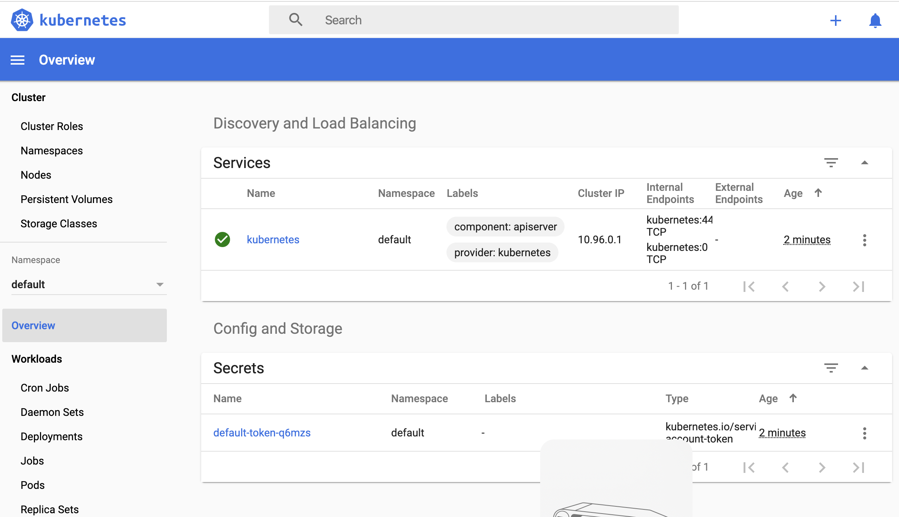

# 사전 준비 사항

- kubernetis-cli (brew install kubernetis-cli > 1.16.1)
- docker (brew cask install docker > 2.1.0.3)
- minikube (brew cask install minikube > 1.4.0)
- virtualbox (brew cask install virtualbox > 6.0.12)

```bash
brew update && brew install  kubernetis-cli && brew cask install docker minikube virtualbox
```

```bash
$ docker --version

  Docker version 19.03.2, build 6a30dfc

$ docker-compose --version

  docker-compose version 1.24.1, build 4667896b

$ docker-machine --version

  docker-machine version 0.16.2, build bd45ab13
 
$ minikube version

  minikube version: v1.4.0
  commit: 7969c25a98a018b94ea87d949350f3271e9d64b6

$ kubectl version --client

  Client Version: version.Info{Major:"1", Minor:"14", GitVersion:"v1.14.6", 
  GitCommit:"96fac5cd13a5dc064f7d9f4f23030a6aeface6cc", GitTreeState:"clean", 
  BuildDate:"2019-08-19T11:13:49Z", GoVersion:"go1.12.9", Compiler:"gc", 
  Platform:"darwin/amd64"}
```

# Minikube Start

Minikube를 시작한다. 약간의 시간이 걸릴 수 있다. 

```bash
$ minikube start

  😄  minikube v1.4.0 on Darwin 10.15
      ▪ KUBECONFIG=/Users/before30/.kube/config
  💡  Tip: Use 'minikube start -p <name>' to create a new cluster, or 'minikube delete' to delete this one.
  🔄  Starting existing virtualbox VM for "minikube" ...
  ⌛  Waiting for the host to be provisioned ...
  🐳  Preparing Kubernetes v1.16.0 on Docker 18.09.9 ...
  🔄  Relaunching Kubernetes using kubeadm ...
  ⌛  Waiting for: apiserver proxy etcd scheduler controller dns
  🏄  Done! kubectl is now configured to use "minikube"

```

Minikube는 Virtualbox 안의 VM을 시작시키고, 그 VM 안에 Kubernetes cluster를 시작시킨다.

# k8s 상태 검증

```bash
$ kubectl get nodes

  NAME       STATUS   ROLES    AGE   VERSION
  minikube   Ready    master   25h   v1.16.0

$ kubectl get all

  NAME                 TYPE        CLUSTER-IP   EXTERNAL-IP   PORT(S)   AGE
  service/kubernetes   ClusterIP   10.96.0.1    <none>        443/TCP   25h
```

# k8s dashboard 실행

테스트와 모니터링을 쉽게하기 위한 k8s dashboard를 실행한다.
(운영 클러스터에서는 권한/보안 이슈 때문에 잘 사용하지 않는다.)

```bash
$ minikube dashboard

  🤔  Verifying dashboard health ...
  🚀  Launching proxy ...
  🤔  Verifying proxy health ...
  🎉  Opening http://127.0.0.1:54367/api/v1/namespaces/kubernetes-dashboard/services/http:kubernetes-dashboard:/proxy/ in your default browser...
```
[dashboard link](http://127.0.0.1:54367/api/v1/namespaces/kubernetes-dashboard/services/http:kubernetes-dashboard:/proxy/#/overview?namespace=default)



# Internal Docker registry 설정

개발 단계에서 만들어진 Docker image를 로컬 테스트 클러스터에서 실행하기 위해 다음 작업을 진행한다.
자신의 Docker image를 클러스터에서 사용하기 위한 몇가지 다른 방법은 아래 블로그를 참조하면 된다.

[Sharing a local registry with minikube link](https://blog.hasura.io/sharing-a-local-registry-for-minikube-37c7240d0615/)

## 1. Docker Daemon 재사용하기

1. docker 환경 연결하기
```bash
$ eval $(minikube docker-env)
```
호스트 장Docker 데몬 재사용을 통해 로컬 이미지를 등록하여 사용하기
[공식 문서 참고](https://kubernetes.io/ko/docs/setup/learning-environment/minikube/#docker-%EB%8D%B0%EB%AA%AC-%EC%9E%AC%EC%82%AC%EC%9A%A9%EC%9D%84-%ED%86%B5%ED%95%9C-%EB%A1%9C%EC%BB%AC-%EC%9D%B4%EB%AF%B8%EC%A7%80-%EC%82%AC%EC%9A%A9%ED%95%98%EA%B8%B0)

minikube docker-env 가 적용되면 process가 아래처럼 보인다
```bash
$  docker ps
  CONTAINER ID        IMAGE                  COMMAND                  CREATED             STATUS              PORTS                    NAMES
  f8ceaa86db0a        4689081edb10           "/storage-provisioner"   About an hour ago   Up About an hour                             k8s_storage-provisioner_storage-provisioner_kube-system_a5c5391e-96c5-43f0-b59c-09477225f9cf_3
  e5d58b4c2181        6802d83967b9           "/dashboard --insecu…"   About an hour ago   Up About an hour                             k8s_kubernetes-dashboard_kubernetes-dashboard-57f4cb4545-g2kpw_kubernetes-dashboard_3b00ca93-073b-4598-9a92-7d16071fec21_3
  7beabfd59d68        bf261d157914           "/coredns -conf /etc…"   About an hour ago   Up About an hour                             k8s_coredns_coredns-5644d7b6d9-xfxvx_kube-system_a7d3e7cf-6bc1-4c64-91b4-313372b08db7_2
  8dfceea7e1a5        bf261d157914           "/coredns -conf /etc…"   About an hour ago   Up About an hour                             k8s_coredns_coredns-5644d7b6d9-p7sz8_kube-system_2c062ac3-2733-4c96-b421-7c3dbf4de19c_2
  19e8a395359f        709901356c11           "/metrics-sidecar"       About an hour ago   Up About an hour                             k8s_dashboard-metrics-scraper_dashboard-metrics-scraper-76585494d8-r9n46_kubernetes-dashboard_89a59784-a098-4f7b-8ad0-5123b405e333_2
...

```

2. 이미지 빌드

```bash
$ ./gradlew :be01:docker

  BUILD SUCCESSFUL in 5s
  7 actionable tasks: 3 executed, 4 up-to-date

$ ./gradlew :be02:docker

  BUILD SUCCESSFUL in 4s
  7 actionable tasks: 3 executed, 4 up-to-date
```

3. 배포 템플릿 설정

Container의 imagePullPolicy 는 Never로 설정한다. 그렇지 않으면 Kubernetes가 Image를 Download를 시도하기 때문에 Deployment에 실패한다.

```yaml
template:
    metadata:
      labels:
        name: be01-app
    spec:
      containers:
        - name: container
          image: be01
          imagePullPolicy: Never
          ports:
            - containerPort: 8080
...
          
```

기타. 도커 연동 해제
```bash
$ eval $(docker-machine env -u)
```

## 2. Local registry를 활용한 방법

1. 환경 설정 연동

```bash
$ eval $(minikube docker-env)
```

2. 로컬 registry 실행

```bash
$ docker run -d -p 5000:5000 --restart=always --name registry registry:2
```

3. 이미지 빌드 및 push

```bash
$ ./gradlew :be01:docker

  BUILD SUCCESSFUL in 5s
  7 actionable tasks: 3 executed, 4 up-to-date

$ docker tag be01 localhostL5000/be01

$ docker push localhost:5000/be01

$ ./gradlew :be02:docker

  BUILD SUCCESSFUL in 5s
  7 actionable tasks: 3 executed, 4 up-to-date

$ docker tag be02 localhostL5000/be02

$ docker push localhost:5000/be02

```

4. 배포 템플릿 설정
```yaml
template:
    metadata:
      labels:
        name: be01-app
    spec:
      containers:
        - name: container
          image: localhost:5000/be01
          imagePullPolicy: Always
          ports:
            - containerPort: 8080
```

기타. 도커 연동 해제

 # Application 배포

```bash
$ kubectl apply -f be01-svc.yaml
  
  service/be01-svc created

$ kubectl apply -f be01-svc.yaml
  
  service/be02-svc created

$ kubectl apply -f be01-deployment.yaml

$ kubectl get all
  NAME                 TYPE        CLUSTER-IP       EXTERNAL-IP   PORT(S)        AGE
  service/be01-svc     NodePort    10.98.140.177    <none>        80:30398/TCP   61s
  service/be02-svc     NodePort    10.103.222.240   <none>        80:30756/TCP   16s
  service/kubernetes   ClusterIP   10.96.0.1        <none>        443/TCP        29h

// edit be01-deployment param with service be02 ip

$  kubectl apply -f be01-deployment.yaml

  deployment.apps/be01-app created
$ kubectl apply -f be02-deployment.yaml

  deployment.apps/be02-app created

$ kubectl get all

  NAME                            READY   STATUS    RESTARTS   AGE
  pod/be01-app-59b868b76-4trzm    1/1     Running   0          47s
  pod/be02-app-69968d9f58-hvl8h   1/1     Running   0          23s
  
  NAME                 TYPE        CLUSTER-IP       EXTERNAL-IP   PORT(S)        AGE
  service/be01-svc     NodePort    10.98.140.177    <none>        80:30398/TCP   4m
  service/be02-svc     NodePort    10.103.222.240   <none>        80:30756/TCP   3m15s
  service/kubernetes   ClusterIP   10.96.0.1        <none>        443/TCP        29h
  
  NAME                       READY   UP-TO-DATE   AVAILABLE   AGE
  deployment.apps/be01-app   1/1     1            1           47s
  deployment.apps/be02-app   1/1     1            1           23s
  
  NAME                                  DESIRED   CURRENT   READY   AGE
  replicaset.apps/be01-app-59b868b76    1         1         1       47s
  replicaset.apps/be02-app-69968d9f58   1         1         1       23s

```

# Kube Cluster 밖으로 연결하기

Minikube에서는 minikube service를 사용해서 Application을 외부와 연동 한다.

```bash
$ minikube service be01-svc
  |-----------|----------|-------------|-----------------------------|
  | NAMESPACE |   NAME   | TARGET PORT |             URL             |
  |-----------|----------|-------------|-----------------------------|
  | default   | be01-svc | http        | http://192.168.99.100:30398 |
  |-----------|----------|-------------|-----------------------------|
  🎉  Opening kubernetes service  default/be01-svc in default browser...

$ curl 192.168.99.100:30398/hello

$ curl 192.168.99.100:30398/api/call/be02

```
 
# 로그 확인하기

```bash
$ kubectl get pod

  NAME                        READY   STATUS    RESTARTS   AGE
  be01-app-59b868b76-4trzm    1/1     Running   0          4m25s
  be02-app-69968d9f58-hvl8h   1/1     Running   0          4m1s

$ kubectl logs be01-app-59b868b76-4trzm


  .   ____          _            __ _ _
 /\\ / ___'_ __ _ _(_)_ __  __ _ \ \ \ \
( ( )\___ | '_ | '_| | '_ \/ _` | \ \ \ \
 \\/  ___)| |_)| | | | | || (_| |  ) ) ) )
  '  |____| .__|_| |_|_| |_\__, | / / / /
 =========|_|==============|___/=/_/_/_/
 :: Spring Boot ::        (v2.1.9.RELEASE)
...

```

# deployment, service 삭제하기

```bash
$ kubectl delete service be01-svc be02-svc
  service "be01-svc" deleted
  service "be02-svc" deleted

$ kubectl delete deployment be01-app be02-app
  deployment.apps "be01-app" deleted
  deployment.apps "be02-app" deleted

$ kubectl get all
  NAME                 TYPE        CLUSTER-IP   EXTERNAL-IP   PORT(S)   AGE
  service/kubernetes   ClusterIP   10.96.0.1    <none>        443/TCP   29h
```
# Minikube 중지

```bash
$ minikube stop
  ✋  Stopping "minikube" in virtualbox ...
  🛑  "minikube" stopped.

```

# Minikube 초기화
```bash
$ minikube delete
$ rm -rf ~/.minikube ~/.kube
```
